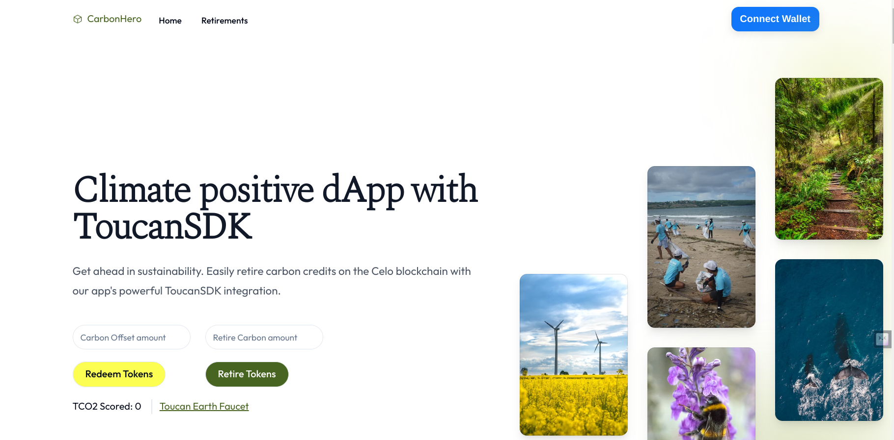

# Retiring Carbon Credits on Celo using Toucan SDK

# CarbonHero
## By Dennis Kimathi | Samson | Mbuvi Muasya

## Screenshot
 

 ## Table of Content
 - [Demo](#demo)
 - [Features](#features)
 - [Requirements](#requirements)
 - [Installation Process](#installation-Process)
 - [Live Link](#Live-Link)
 - [Technology  Used](#technology-Used)
 - [Tutorial](#license)
 - [Authors Info](#Authors-Info)


[Go Back to the top](#CarbonHero)


## Demo


## Features
1. As a user, I want to redeem NCT for TCO2 - Tokenized Carbon Credit.
2. A user can retire TC02
3. A user can view their TC02 retired.
4. A user can view details of TC02 available on toucan alfajores subgraph. 


[Go Back to the top](#CarbonHero)

 ###  Requirements
 * Access to  a computer 
 * Access to internet

 ### Installation Process
 ****
* Clone to the repo : git clone https://github.com/DennohKim/toucan-protocol-sdk
* In the root directory, run the following command to install the packages ``` yarn```.
* Run `yarn react-app:dev` to launch the app

 ****
 [Go Back to the top](#CarbonHero)

### Live Link
- Click this link to view the live application https://toucan-protocol-sdk-react-app.vercel.app/

### Technology  Used

- [Celo-composer](https://github.com/celo-org/celo-composer)

Celo Composer is built on Celo to make it simple to build dApps using a variety of front-end frameworks, and libraries.

- [Celo](https://celo.org/)
- [Solidity](https://docs.soliditylang.org/en/v0.8.19/)
- [Next.js](https://nextjs.org/)
- [React.js](https://reactjs.org/)
- [Shadcn UI](https://ui.shadcn.com/)
- [Rainbowkit-celo](https://github.com/celo-org/rainbowkit-celo)

- [Toucan-SDK](https://docs.toucan.earth/toucan/dev-resources/sdk)


[Go Back to the top](#CarbonHero)


### Tutorial

Retire Carbon Credits on Celo using ToucanSDK
Learn how to make your dApp climate positive with a few lines of code.
Climate change is real, and thinking of our carbon footprint when building software should be part of the planning process as much as thinking about the architecture. One blockchain that is leading in this regard is Celo blockchain, and they are even offsetting more carbon than they are producing. So, if your choice of network for your application is Celo, you already made a step in the right direction. But other actions can increase your or your users carbon footprint and, in this tutorial, you will learn how to account for that in a few lines of code and create a climate positive app. If you are new to carbon credit retirements and what kind of infrastructure tools Toucan provides, make sure to read up on it in their blog.

### Prerequisites:

To start building, you'll need a basic understanding of web development, Node (v12), yarn, and Git.

- Node
- Yarn
- Git

### Tools we will use:

- Celo-Composer
- Toucan SDK

Okay. What will learn in this tutorial in detail? We will learn how to retire carbon credits on Celo in a React. To do that we will redeem Nature Carbon Tonnes (NCTs) for tokenized carbon credits (TCO2s) and retire those. We will also learn how to get all data related to tokens and retirements through querying the [subgraph](https://thegraph.com/hosted-service/subgraph/toucanprotocol/alfajores).

By the end of this tutorial, you will know

- how to redeem NCT for TCO2
- how to retire TCO2
- how to query the subgraph to get details on tokens, retirements and certificates

**_And now lets start building 🏗_**

---

## Install Celo-Composer

We will use Celo-Composer to quick-start our web3 application. It already comes with several wallet integrations using rainbow-kit, wagmi for easy interactions with the blockchain and tailwind for styling.

Make sure to use the right version of Celo Composer. The newer version is already upgraded to wagmi 1.xx. But the Toucan SDK is not yet.

```
npx @celo/celo-composer create
```

To create a simple example project, we just chose the default, except for Choose smart-contract framework:, there we choose none as we won't need that for this tutorial.

Great. Now let's open the project in our favorite IDE (e.g., VS Code).

First navigate into the react-app.

```
cd packages/react-app/
```

Here install all dependencies with

```
npm i
```

or

```
yarn
```

And finally, let's start the App and see if everything is running.

```
npm run dev
```

or

```
yarn run dev
```

---

## Create ethers adapters using ethers v5 and viem

Toucan SDK uses etherjs library. Since celo composer upgraded to wagmi v1 which uses viem, we will have to create adapters for that.

Check new migration guides here - [Migration guides](https://wagmi.sh/react/ethers-adapters)

### Create a provider

Create a utils folder and create a new file named provider.ts

```typescript

import * as React from 'react'
import { type PublicClient, usePublicClient } from 'wagmi'
import { providers } from 'ethers'
import { type HttpTransport } from 'viem'

export function publicClientToProvider(publicClient: PublicClient) {
  const { chain, transport } = publicClient
  const network = {
    chainId: chain.id,
    name: chain.name,
    ensAddress: chain.contracts?.ensRegistry?.address,
  }
  if (transport.type === 'fallback')
    return new providers.FallbackProvider(
      (transport.transports as ReturnType<HttpTransport>[]).map(
        ({ value }) => new providers.JsonRpcProvider(value?.url, network),
      ),
    )
  return new providers.JsonRpcProvider(transport.url, network)
}

/** Hook to convert a viem Public Client to an ethers.js Provider. */
export function useEthersProvider({ chainId }: { chainId?: number } = {}) {
  const publicClient = usePublicClient({ chainId })
  return React.useMemo(() => publicClientToProvider(publicClient), [publicClient])
}


```

### Create a signer

Inside the utils folder, create a new file named signer.ts


```typescript

import * as React from 'react'
import { type WalletClient, useWalletClient } from 'wagmi'
import { providers } from 'ethers'

export function walletClientToSigner(walletClient: WalletClient) {
  const { account, chain, transport } = walletClient
  const network = {
    chainId: chain.id,
    name: chain.name,
    ensAddress: chain.contracts?.ensRegistry?.address,
  }
  const provider = new providers.Web3Provider(transport, network)
  const signer = provider.getSigner(account.address)
  return signer
}

/** Hook to convert a viem Wallet Client to an ethers.js Signer. */
export function useEthersSigner({ chainId }: { chainId?: number } = {}) {
  const { data: walletClient } = useWalletClient({ chainId })
  return React.useMemo(
    () => (walletClient ? walletClientToSigner(walletClient) : undefined),
    [walletClient],
  )
}
```

## Retire Carbon Credits

Next, we are going to retire carbon credits on Celo using the Toucan SDK. The Toucan SDK provides you with tools to simply implement carbon retirements into your app with just a few lines of code. It also provides some pre-defined subgraph queries but offers you the freedom to create any query your heart desires to get all the info about all retirements and tokens.

---

## Install the SDK

Add the Toucan SDK.

```
npm i toucan-sdk
```

or

```
yarn add toucan-sdk
```

### Get Toucan Client

We want to first instantiate the ToucanClient and set a signer & provider to interact with our infrastructure. We can use the signer & provider from the wagmi library. For interacting with The Graph, no provider or signer is needed though. But we will talk about that later.

So in the index.ts file we will add the imports to the top:

```typescript
import ToucanClient from "toucan-sdk";
import { useEthersProvider } from "@/utils/provider";
import { useEthersSigner } from "@/utils/signer";
```

And this part into our function body. You can set the signer and provider directly or at a later point. Here we want to first check if the signer is set, meaning if the user is connected to the application with their wallet.

```typescript
const provider = useEthersProvider();
const signer = useEthersSigner();

const toucan = new ToucanClient("alfajores", provider);
signer && toucan.setSigner(signer);
```

In the end our code should look like this:

```typescript
import ToucanClient from "toucan-sdk";
import { useEthersProvider } from "@/utils/provider";
import { useEthersSigner } from "@/utils/signer";


export default function Home() {
  const provider = useEthersProvider();
  const signer = useEthersSigner();

  const toucan = new ToucanClient("alfajores", provider);
  signer && toucan.setSigner(signer);

  return (
    <div>
      <div className="h1">
        There we go... a canvas for your next Celo project!
      </div>
    </div>
  );
}
```

---

### Redeem Tokens form a PoolContract (e.g. NCT)

To retire Carbon Credits, we need pool tokens (e.g., NCTs) or carbon reference tokens like TCO2s. We can get them from the Toucan Faucet. In this example we will get NCT, as theses are the tokens, you can buy in an exchange like Ubeswap.

What is the difference between NCTs and TCO2s? Simply put, TCO2s are tokenized carbon credits. While NCT are the first carbon reference tokens created on Toucans infrastructure and are stripped of most attributes. As a user you will only have TCO2 tokens, if you tokenized carbon credits yourself or if you have already redeemed NCTs for TCO2s. So, this example will start with NCTs.

🍃 Get some Nature Carbon Tonnes (NCT) form the Toucan Faucet before you continue. Make sure you have CELO to pay the gas fee for the withdrawal, you can get some from the Celo Faucet. 🍃

Now, using the ToucanSDK we will auto-redeem the Pool tokens with `toucan.redeemAuto2`, where they are exchanged for the lowest ranking TCO2s. The function also returns the addresses of the redeemed TCO2s, which we need for the next step. As arguments for the function, we will need the pool symbol, that we want to retire, like "NCT". We will also need to input the amount of tokens we wish to retire, use `parseEther("1")` from the "ethers.js" for that.

If we prefer to choose the TCO2s that we want to retire, we can get a list of all TCO2s with `getScoredTCO2s` and then select the ones we prefer. Currently scored TCO2 means, that the tokens are sorted by year with `scoredTokens[0]` being the lowest. Using the Toucan SDK, you can get more info on each of the tokens though querying the subgraph (as described in the next part), and decide your own criteria, based on the newly released Core Carbon Principals. When choosing the TCO2 you want to retire, make sure that the balance of the token is not 0.

After having chosen TCO2s we want to retire, (we can choose several) we can redeem them with toucan.redeemMany. For this Toucan Protocol takes fees. We can calculate the fee beforehand with toucan.`toucan.calculateRedeemFees`.

But today we stay simple with `toucan.redeemAuto2`. The minimum amount you can redeem is 1 NCT in one transaction:

await toucan.redeemAuto2("NCT", parseEther("1"));
Now let's put that code in a function and add a button to trigger it, so we can see it in action!! We also want to store the return value, the TCO2 address in a variable, as we will want to use it in the next step.

```typescript
import { parseEther } from "ethers/lib/utils.js";
import ToucanClient from "toucan-sdk";
import { useState } from "react";
import { useEthersProvider } from "@/utils/provider";
import { useEthersSigner } from "@/utils/signer";


export default function Home() {
  const provider = useEthersProvider();
  const signer = useEthersSigner();

  const toucan = new ToucanClient("alfajores", provider);
  signer && toucan.setSigner(signer);

  // we will store our return value here
  const [tco2address, setTco2address] = useState("");

  const redeemPoolToken = async (): Promise<void> => {
    const redeemedTokenAddress = await toucan.redeemAuto2(
      "NCT",
      parseEther("1")
    );
    redeemedTokenAddress && setTco2address(redeemedTokenAddress[0].address);
  };

  return (
    <div>
      <button
        className="inline-flex w-full justify-center rounded-full border px-5 my-5 py-2 text-md font-medium border-wood bg-prosperity text-black hover:bg-snow"
        onClick={() => redeemPoolToken()}
      >
        {"Redeem Tokens"}
      </button>
    </div>
  );
}
```

Okayyyy, let's connect our wallet Wallet Connect button and redeem the token. And 👓 Check the transaction on [Celoscan](https://alfajores.celoscan.io) 👓

---

### Retire TCO2s

After having redeemed our pool tokens for TCO2s, we will be able to retire them. We can only retire TCO2 tokens. We can either choose to simply toucan.retire or if we would like to retire for a third party use the toucan.retireFrom function. Lastly, we can also already get a certificate created with `toucan.retireAndMintCertificate`.

The first thing we will have to do, will be to get the address of our TCO2 token. We will have saved that as return value form toucan.redeemAuto2. And now we can retire our token.

```typescript
await toucan.retire(parseEther("1.0"), tco2Address);
```

Let's create a second function called retirePoolToken as well as a button for the retirement process.

```typescript
import { parseEther } from "ethers/lib/utils.js";
import { useState } from "react";
import ToucanClient from "toucan-sdk";
import { useEthersProvider } from "@/utils/provider";
import { useEthersSigner } from "@/utils/signer";

export default function Home() {
 const provider = useEthersProvider();
  const signer = useEthersSigner();

  const toucan = new ToucanClient("alfajores", provider);
  signer && toucan.setSigner(signer);
  const [tco2address, setTco2address] = useState("");

  const redeemPoolToken = async (): Promise<void> => {
    const redeemedTokenAddress = await toucan.redeemAuto2(
      "NCT",
      parseEther("1")
    );
    redeemedTokenAddress && setTco2address(redeemedTokenAddress[0].address);
  };

  const retirePoolToken = async (): Promise<void> => {
    tco2address.length && (await toucan.retire(parseEther("1.0"), tco2address));
  };

  return (
    <div>
      <button
        className="inline-flex w-full justify-center rounded-full border px-5 my-5 py-2 text-md font-medium border-wood bg-prosperity text-black hover:bg-snow"
        onClick={() => redeemPoolToken()}
      >
        {"Redeem Tokens"}
      </button>
      <button
        className="inline-flex w-full justify-center rounded-full border px-5 my-5 py-2 text-md font-medium border-wood bg-prosperity text-black hover:bg-snow"
        onClick={() => retirePoolToken()}
      >
        {"Retire Tokens"}
      </button>
    </div>
  );
}
```

You now have the foundation to implement retirement with endless possibilities like in one function and trigger retirements based on an input.
image of the app with buttons to redeem and retire

---

## Creating a list of our retirements

In the last step, we are creating a list showing our retirements. First, we will create a new `list.tsx` page.

Here we need the Toucan Client again. This time, we won't need a provider or signer as we are only querying the [subgraph](https://thegraph.com/hosted-service/subgraph/toucanprotocol/alfajores).

```typescript
const toucan = new ToucanClient("alfajores");
```

The Toucan SDK has several pre-defined queries to get data from the subgraph, but we can also create our customized query with `toucan.fetchCustomQuery()`. We can check all schemes, create and test our query in the playground of the [Toucan Subgraph](https://thegraph.com/hosted-service/subgraph/toucanprotocol/alfajores).

For now, we will use one of the predefined queries, to get a list of our retirements. We will need the user address here so we will use the useAccount Hook from wagmi. Remember that an address (user, token) always needs to be lower case for querying.

```typescript
const { address } = useAccount();

await toucan.fetchUserRetirements(address?.toLowerCase());
```

Now let's add save the return value in a state, add typing for our retirement data, fetch the user retirements when the component is loading and add some code to display our retirements in a table.

```typescript
import { useEffect, useState } from "react";
import ToucanClient, { UserRetirementsResponse } from "toucan-sdk";
import { useAccount } from "wagmi";

export default function List() {
  const toucan = new ToucanClient("alfajores");
  const { address } = useAccount();

  const [retirements, setRetirements] = useState([]);

  const getUserRetirements = async () => {
    const result =
      address && (await toucan.fetchUserRetirements(address?.toLowerCase()));
    result && setRetirements(result);
  };

  useEffect(() => {
    getUserRetirements();
  });

  return (
    <div>
      <div className="mt-8 flow-root">
        <div className="-mx-4 -my-2 overflow-x-auto sm:-mx-6 lg:-mx-8">
          <div className="inline-block min-w-full py-2 align-middle sm:px-6 lg:px-8">
            {retirements.length && (
              <div className="overflow-hidden ring-1 ring-black">
                <table className="min-w-full divide-y divide-black">
                  <thead className="bg-prosperity">
                    <tr>
                      <th
                        scope="col"
                        className="py-3.5 pl-4 pr-3 text-left text-sm font-semibold text-gray-900 sm:pl-6"
                      >
                        Token Name
                      </th>
                      <th
                        scope="col"
                        className="px-3 py-3.5 text-left text-sm font-semibold text-gray-900"
                      >
                        Token Symbol
                      </th>
                      <th
                        scope="col"
                        className="px-3 py-3.5 text-left text-sm font-semibold text-gray-900"
                      >
                        Certificate ID
                      </th>
                      <th
                        scope="col"
                        className="px-3 py-3.5 text-left text-sm font-semibold text-gray-900"
                      >
                        Creation Tx
                      </th>
                    </tr>
                  </thead>
                  <tbody className="divide-y divide-black bg-white">
                    {retirements.map((item) => {
                      return (
                        <tr key={item.id}>
                          <td className="whitespace-nowrap py-4 pl-4 pr-3 text-sm font-medium text-gray-900 sm:pl-6">
                            {item.token.name}
                          </td>
                          <td className="whitespace-nowrap px-3 py-4 text-sm text-gray-500">
                            {item.token.symbol}
                          </td>
                          <td className="whitespace-nowrap px-3 py-4 text-sm text-gray-500">
                            {item.certificate?.id}
                          </td>
                          <td className="relative whitespace-nowrap py-4 pl-3 pr-4 text-right text-sm font-medium sm:pr-6">
                            <a
                              target="\_blank"
                              rel="noopener noreferrer"
                              href={`https://alfajores.celoscan.io/tx/${item.creationTx}`}
                              className="text-forest hover:text-forest"
                            >
                              ...
                              {item.creationTx.substring(
                                item.creationTx.length - 15
                              )}
                            </a>
                          </td>
                        </tr>
                      );
                    })}
                  </tbody>
                </table>
              </div>
            )}
          </div>
        </div>
      </div>
    </div>
  );
}
```

Add the list page into the header.tsx file and your "Retirement List Page" and you are done!

---

Congratulations! You've build your first climate positive app. Now go explore more ways to build on Toucan in

- Toucan's [documentation](https://docs.toucan.earth/toucan/dev-resources/toucan-developer-resources)
- Toucan's [SDK](https://github.com/ToucanProtocol/toucan-sdk)
- Toucan's [blog](https://blog.toucan.earth)

## Authors Info
Contributors - [Dennis Kimathi](https://github.com/DennohKim)
