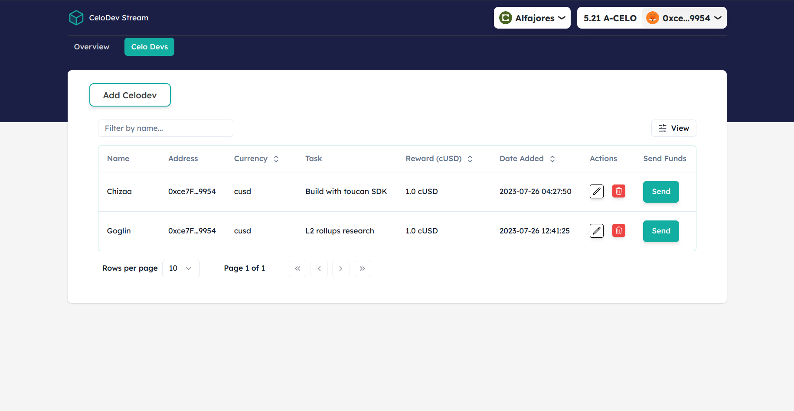

# CeloDev Stream Web App
## By Dennis Kimathi | Anthony Kimani

## Screenshot
 


## Celo Code Jam Theme Tracks

  - __UI/UX Track__  &  __Social Impact__


 ## Table of Content
 - [Demo Video](#demo-video)
 - [Features](#features)
 - [Requirements](#requirements)
 - [Installation Process](#installation-Process)
 - [Live Link](#Live-Link)
 - [Technology  Used](#technology-Used)
 - [License](#license)
 - [Authors Info](#Authors-Info)


## Demo video

https://github.com/DennohKim/Celo-Code-Jam-3.0/assets/63696529/19df3d56-75d6-40f8-925e-aebc27eca585

[Go Back to the top](#CeloDev-Stream-Web-app)
## Features
1. As a user, I want to create, update and delete developer details so that I can stream funds to their wallet address.
2. As a user, I want to send cUSD to a developer using superfluid.


 ###  Requirements
 * Access to  a computer 
 * Access to internet

 ### Installation Process
 ****
* Clone to the repo : git clone https://github.com/DennohKim/codejam-streaming-rewards
* In the root directory, run the following command to install the packages ``` yarn```.
* Run `yarn react-app:dev` to launch the app

 ****

### Live Link
- Click this link to view the live application https://codejam-streaming-rewards-react-app.vercel.app/

### Technology  Used

- [Celo-composer](https://github.com/celo-org/celo-composer)

Celo Composer is built on Celo to make it simple to build dApps using a variety of front-end frameworks, and libraries.

- [Celo](https://celo.org/)

https://github.com/DennohKim/Celo-Code-Jam-3.0/assets/63696529/7c6bed42-fcbe-4a9c-91be-08436a8dda30


- [Solidity](https://docs.soliditylang.org/en/v0.8.19/)
- [Next.js](https://nextjs.org/)
- [React.js](https://reactjs.org/)
- [Shadcn UI](https://ui.shadcn.com/)
- [Rainbowkit-celo](https://github.com/celo-org/rainbowkit-celo)

- [Superfluid-finance](https://www.superfluid.finance/)

Superfluid is a revolutionary asset streaming protocol that brings subscriptions, salaries, vesting, and rewards to DAOs and crypto-native businesses worldwide.


## License
MIT License
Copyright (c) [2022] [License](LICENSE.txt)
Permission is hereby granted, free of charge, to any person obtaining a copy
of this software and associated documentation files (the "Software"), to deal
in the Software without restriction, including without limitation the rights
to use, copy, modify, merge, publish, distribute, sublicense, and/or sell
copies of the Software, and to permit persons to whom the Software is
furnished to do so, subject to the following conditions:
The above copyright notice and this permission notice shall be included in all
copies or substantial portions of the Software.
THE SOFTWARE IS PROVIDED "AS IS", WITHOUT WARRANTY OF ANY KIND, EXPRESS OR
IMPLIED, INCLUDING BUT NOT LIMITED TO THE WARRANTIES OF MERCHANTABILITY,
FITNESS FOR A PARTICULAR PURPOSE AND NONINFRINGEMENT. IN NO EVENT SHALL THE
AUTHORS OR COPYRIGHT HOLDERS BE LIABLE FOR ANY CLAIM, DAMAGES OR OTHER
LIABILITY, WHETHER IN AN ACTION OF CONTRACT, TORT OR OTHERWISE, ARISING FROM,
OUT OF OR IN CONNECTION WITH THE SOFTWARE OR THE USE OR OTHER DEALINGS IN THE
SOFTWARE.

## Authors Info

Contributors  
- [Dennis Kimathi](https://github.com/DennohKim)
- [Anthony Kimani](https://github.com/anthonykimani)

 

[Go Back to the top](#CeloDev-Stream-Web-app)
